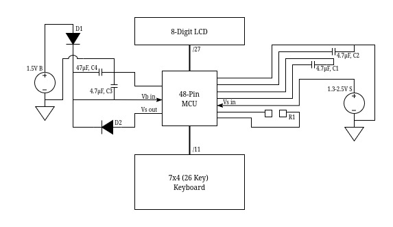

# Product Analysis

  Home: &#x2302; [Introduction](../index.md) &#x2302;  

##

## High-Level Block Diagram

## Circuit Schematics

The two schottky diodes, with low voltage dropouts of 0.15V, prevent the backflow of voltage from the solar cell across the MCU into the battery and vice versa.

## Electronic Characteristics

The device is primarily powered by a 1.5V alkaline button cell battery, the LR1130. This battery is reported as having a capacity between 50 – 80 mAh [\[1\]](#1-microbattery-lr1130-battery-microbatterycom). The maximum voltage out generated by the solar cells is 2.5V. So, it is assumed that normal operations for the device occur within the 1.5 – 2.5V range.

| Component | Supply Voltage (V) | Operating Voltage (V) | Current Draw (mA)| 
| - | - | - | - |
| MCU | 1.0 | 0.96 | N/A |
| C.P. LCD Pin | 1 | 0 (DC) | 0.1 |
| Seg. LCD Pin | 1 | 0 (DC) | 0.01 | 
| MCU | 1.5 | 1.44 | N/A |
| C.P. LCD Pin | 1.5 | 0 (DC) | 0.6 |
| Seg. LCD Pin | 1.5 | 0 (DC) | 0.07 |
| MCU | 3.0 | 2.89 | N/A |
| C.P. LCD Pin | 3 | 0 (DC) | 2.7 |
| Seg. LCD Pin | 3 | 0 (DC) | 0.3 |

 

Each of LCD pins transmit AC signals with an equivalent DC voltage of 0V to prevent degradation of the LCD crystals. The MCU has no load between either of the power sources and their respective "in" pins; there is likely an internal resistance, but, as it stands, there is no reasonable way to measure the total current draw of the MCU. As such, the battery lifetime provided below is based on the maximum current draw of the common plane pins for the LCD at the normal supply voltage of the battery of 1.5V.  

**50 mAh / 0.6 mA = 83.3 hours**

**80 mAh / 0.6 mA = 133.3 hours**

The total battery usage is also offset by the solar cells when sufficient light is present, so the actual battery lifetime is likely significantly longer. These numbers can simply be used to represent the potential battery lifetime in absolute absence of light.  

## Bill of Materials

Many of these components are now obsolete or are marked with manufacturer-specific codes, such as the diodes. As such, best-fit components have been selected, based on the measured ratings, appearance, and functionality of each component, to estimate the approximate bill of materials. Where possible, bulk prices were used for components to replicate manufacturing practices.

### Electronic Components

| Symbol | Value | Part # | Manufacturer | Quantity | Price | # Units | Price/Unit	| Price/Device |
| - | - | - | - | - | - | - | - | - |
| B | 1.5V | LR1130 | Toshiba Lifestyle Products | 1x | $740.00 | 4,000 | $0.18500 | $0.18500 [\[2\]](#2-digi-key-electronics-digikey-lr1130-digikeycom)
| S | Max 2.5V | KXOB25-05X3F-TR | ANYSOLAR | 1x | $4,031.25 | 2,500 | $1.61250 | $1.61250 [\[3\]](#3-digi-key-electronics-digikey-kxob25-05x3f-tr-digikeycom)
| C1&2&3 | 4.7 µF | CL10A475KP8NNNC | Samsung Electro- Mechanics | 3x | $19.36 | 4,000 | $0.00484 | $0.01452 [\[4\]](#4-digi-key-electronics-digikey-cl10a475kp8nnnc-digikeycom)
| C4 | 47 µF | CL21A476MQYNNNE | Samsung Electro- Mechanics | 1x | $83.18 | 2,000 | $0.04159 | $0.04159 [\[5\]](#5-digi-key-electronics-digikey-cl21a476mqynnne-digikeycom)
| D1&2 | 20V 2A | SB220-E3/54 | Vishay General Semiconductor | 2x | $570.24 | 4,000 | $0.14256 | $0.28512 [\[6\]](#6-digi-key-electronics-digikey-sb220-e354-digikeycom)
| | | | | | | | Total Cost   Per Device | $2.13873 

Provided the above table, the approximate cost to produce a single device, purely in electronic components *(and not including spooled materials, such as jumper cables, flex cables, or solder since they are used as needed)*, is **$2.14**.

### Non-Electronic Components

| Component | Part # | Manufacturer | Quantity | Price | # Units | Price/Unit | Price/Device |
| - | - | - | - | - | - | - | - | 
| LCD | VIM-838-DP-RC-S-LV-6 | Varitronix | 1x | $3,052.89 | 1,000 | $3.05289 | $3.05289 [\[7\]](#7-digi-key-electronics-digikey-vim-838-dp-rc-s-lv-6-digikeycom)
| Plastic | N/A | 
| Rubber | N/A | 
| Screws | -002MPF | Kanebridge | 2x | $1,100.00 | 10,000 | $0.11000 | $0.22000 [\[8\]](#8-digi-key-electronics-digikey--002mpf-digikeycom)

PCB printing and construction-related costs were left out of the bill of materials for simplicity sake. 

 

**Total Cost: **

## 
 
  Prev: ◄— [Product Operation](../html/operation.md) ◄—  
Next: —► [Reassembly](../html/reassembly.md) —►

##

## References

#### \[1\] Microbattery, “LR1130 Battery,” microbattery.com.

https://www.microbattery.com/alkaline/lr1130-189.html (accessed   Apr. 21, 2025). 

#### \[2\] Digi-Key Electronics, “DigiKey LR1130,” digikey.com.

https://www.digikey.com/en/products/detail/micropower-battery-company/LR1130/13283124 (accessed   Apr. 21, 2025). 

#### \[3\] Digi-Key Electronics, “DigiKey KXOB25-05X3F-TR,” digikey.com.

https://www.digikey.com/en/products/detail/anysolar-ltd/KXOB25-05X3F-TR/9990478 (accessed   Apr. 21, 2025). 

#### \[4\] Digi-Key Electronics, “DigiKey CL10A475KP8NNNC,” digikey.com.

https://www.digikey.com/en/products/detail/samsung-electro-mechanics/CL10A475KP8NNNC/3886702 (accessed   Apr. 21, 2025). 

#### \[5\] Digi-Key Electronics, “DigiKey CL21A476MQYNNNE,” digikey.com.

https://www.digikey.com/en/products/detail/samsung-electro-mechanics/CL21A476MQYNNNE/3887510 (accessed   Apr. 21, 2025). 

#### \[6\] Digi-Key Electronics, “DigiKey SB220-E3/54,” digikey.com.

https://www.digikey.com/en/products/detail/vishay-general-semiconductor-diodes-division/SB220-E3-54/2146194 (accessed   Apr. 21, 2025). 

#### \[7\] Digi-Key Electronics, “DigiKey VIM-838-DP-RC-S-LV-6,” digikey.com.

https://www.digikey.com/en/products/detail/varitronix/VIM-838-DP-RC-S-LV-6/1118602 (accessed   Apr. 21, 2025). 

#### \[8\] Digi-Key Electronics, “DigiKey -002MPF,” digikey.com.

https://www.digikey.com/en/products/detail/fix-supply/002MPF/21634439?s=N4IgjCBcoKwOxyqAxlAZgQwDYGcCmANCAPZQDa4ATAAwCcEAukQA4AuUIAyqwE4CWAOwDmIAL5E4MACxIQqSJlyES5ELQAccRi3aQuvQSPHgAbNXWz5i-EVKQKAZnUmpMaiCYg2Hbv2FjRUSA (accessed   Apr. 21, 2025). 
