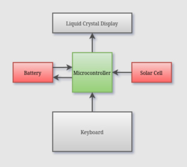
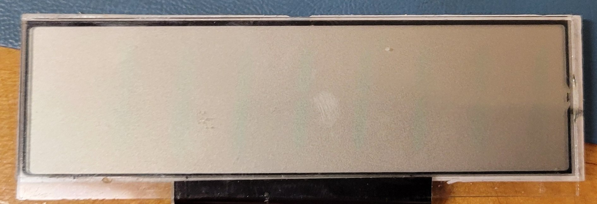
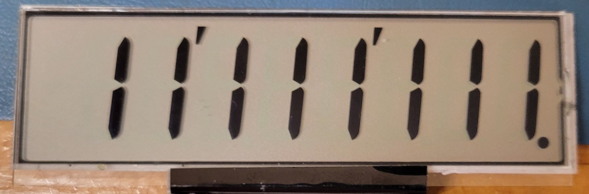

# Product Analysis

  Home: &#x2302; [Introduction](../index.md) &#x2302;  

##

## High-Level Block Diagram

The battery and solar cells serve as primary power sources for the calculator; the keyboard and LCD are I/O devices with all logic required to read from and write to them handled by the microcontroller.

The battery is portrayed as providing and receiving power, but it is important to note that the "received" power from the solar cell is actually blocked as discussed in next section.

## Circuit Schematics

The two Schottky diodes, with low voltage dropouts of 0.15V, prevent the backflow of voltage from the solar cell across the MCU into the battery and vice versa. As such, the solar cells are not capable of recharging the battery and only extend its lifetime indirectly by providing an alternative power source to drive the microcontroller.

## Electronic Characteristics

The device is primarily powered by a 1.5V alkaline button cell battery, the LR1130. This battery is reported as having a capacity between 50 – 80 mAh [\[1\]](#1-microbattery-lr1130-battery-microbatterycom). The maximum voltage out generated by the solar cells is 2.5V. So, it is assumed that normal operations for the device occur within the 1.5 – 2.5V range.

| Component | DC Supply Voltage – (V)  | Operating Voltage (V) | Current Draw (mA)| 
| - | - | - | - |
| MCU | 1.0 | 0.96 (DC) | N/A |
| C.P. LCD Pin | 1.0 | -1.0 – 1.0 (AC) | 0.1 |
| Seg. LCD Pin | 1.0 | -1.2 – 1.0 (AC) | 0.01 | 
| MCU | 1.5 | 1.44 (DC) | N/A |
| C.P. LCD Pin | 1.5 | -1.5 – 1.5 (AC) | 0.6 |
| Seg. LCD Pin | 1.5 | -1.62 – 1.62 | 0.07 |
| MCU | 3.0 | 2.89 (DC) | N/A |
| C.P. LCD Pin | 3.0 | -3.0 – 3.0 (AC) | 2.7 |
| Seg. LCD Pin | 3 .0| -3.25 – 3.25 (AC) | 0.3 |

 

It should be noted that the current draw of the LCD pins is largely negligible, as LCDs behave like capacitive loads rather than resistive ones. Current does not flow continuously through the segments to determine whether they are on or off. Instead, the appearance of each segment is controlled by the electric field across it, which is characterized by the RMS voltage between the segment and its respective common plane with larger RMS voltages corresponding to darker segments.

The small currents that are observed on each pin appear as brief spikes during voltage transitions (the jumps between peaks and troughs), caused by the charging and discharging of the segment’s capacitance. These are not sustained currents; instead, they are a byproduct of the LCD’s capacitive nature.

Sample images showing the LCD behavior at each tested voltage level have been provided below.

### LCD Characteristics

**Figure 1: LCD with Supply Voltage 1.0V**

Extremely faint, but the segments to display 1 are still just barely visible.

**Figure 2: LCD with Supply Voltage 1.5V**

Normal level of visibility.

**Figure 3: LCD with Supply Voltage 3.0V**

Looking head on, it is nearly impossible to determine which segments were intended to be displayed.

**Figure 4: LCD with Supply Voltage 3.0V (Tilted)**

At a slight angle, the segments intended to be displayed are slightly darkened.

Regardless of the supply voltage level, each of the LCD pins transmits AC signals with a net DC voltage of 0V to prevent degradation of the liquid crystal material. The microcontroller (MCU) has no measurable load between the power source and its corresponding input pins. While there is likely some internal resistance, there is no practical way to determine the MCU’s total current draw. Therefore, the estimated battery lifetime provided below is based solely on the measured current draw of the LCD’s common plane pins, taken at the nominal supply voltage of 1.5V.

**50 mAh / 0.6 mA = 83.3 hours**

**80 mAh / 0.6 mA = 133.3 hours**

The total battery usage is also offset by the solar cells when sufficient light is present, so the actual battery lifetime is likely significantly longer. These numbers can simply be used to represent the potential battery lifetime in absolute absence of light.

## Bill of Materials

The cost of the microcontroller is not directly discussed in this section as it is obscured and likely CASIO propriety; however, it is worth noting that the MCU is a chip-on-board application-specific integrated-chip (ASIC) obscured by black epoxy. This method of directly mounting the die to the board and coating it with epoxy is done to minimize manufacturing costs.

Many of the components used in the device are now obsolete or are marked with manufacturer-specific codes, such as the diodes, LCD, and solar cells. As such, best-fit components have been selected, based on the measured ratings, appearance, and functionality of each component, to estimate the approximate bill of materials in the following sections. Where possible, bulk prices were used for components to replicate manufacturing practices.

### Electronic Components

| Symbol | Value | Part # | Manufacturer | Quantity | Price | # Units | Price/Unit	| Price/Device |
| - | - | - | - | - | - | - | - | - |
| B | 1.5V | LR1130 | Toshiba Lifestyle Products | 1x | $740.00 | 4,000 | $0.18500 | $0.18500 [\[2\]](#2-digi-key-electronics-digikey-lr1130-digikeycom)
| S | Max 2.5V | KXOB25-05X3F-TR | ANYSOLAR | 1x | $4,031.25 | 2,500 | $1.61250 | $1.61250 [\[3\]](#3-digi-key-electronics-digikey-kxob25-05x3f-tr-digikeycom)
| C1&2&3 | 4.7 µF | CL10A475KP8NNNC | Samsung Electro- Mechanics | 3x | $19.36 | 4,000 | $0.00484 | $0.01452 [\[4\]](#4-digi-key-electronics-digikey-cl10a475kp8nnnc-digikeycom)
| C4 | 47 µF | CL21A476MQYNNNE | Samsung Electro- Mechanics | 1x | $83.18 | 2,000 | $0.04159 | $0.04159 [\[5\]](#5-digi-key-electronics-digikey-cl21a476mqynnne-digikeycom)
| D1&2 | 20V 2A | SB220-E3/54 | Vishay General Semiconductor | 2x | $570.24 | 4,000 | $0.14256 | $0.28512 [\[6\]](#6-digi-key-electronics-digikey-sb220-e354-digikeycom)
| | | | | | | | Total Cost   Per Device | $2.13873 

Provided the above table, the approximate cost to produce a single device, purely in electronic components *(and not including spooled materials, such as jumper cables, flex cables, or solder since they are used as needed)*, is **$2.14**.

### Non-Electronic Components

| Component | Part # | Manufacturer | Quantity | Price | # Units | Price/Unit | Price/Device |
| - | - | - | - | - | - | - | - | 
| LCD | VIM-838-DP-RC-S-LV-6 | Varitronix | 1x | $3,052.89 | 1,000 | $3.05289 | $3.05289 [\[7\]](#7-digi-key-electronics-digikey-vim-838-dp-rc-s-lv-6-digikeycom)
| Plastic | N/A | PPR | 26.2g | $2,931.00 | 1600 lbs | $1.83188/lb | $0.10581 [\[8\]](#8-premier-plastic-resins-hips-high-impact-polystyrene-prime-premierplasticresinscom)
| Silicone | N/A | APSX | 5.4g | $75.00 | 2 lbs | $37.50/lb | $0.44644 [\[9\]](#9-advanced-production-systems-thermoplastic-elastomer-tpe-aspxcom)
| Screws | -002MPF | Kanebridge | 2x | $1,100.00 | 10,000 | $0.11000 | $0.22000 [\[10\]](#10-digi-key-electronics-digikey--002mpf-digikeycom)
| | | | | | | Total Cost   Per Device | $3.82514

PCB printing and construction-related costs were left out of the bill of materials for simplicity sake.  

Thermoplastic elastomers (TPEs) were chosen as the base material for the keyboard because they are very similar in feel and appearance to silicone rubbers, but they are more cost effective and easier to manufacture [\[11\]](#11-avient-a-beginners-guide-to-tpe-avientcom).

 

**Total Cost: $5.96**

The actual calculator retails direct from the manufacturer for $7.41 [\[12\]](#12-casio-sl-100l-pocket-calculator-casiocom). It can be assumed that Casio isn't settling for a mere $1.45 in profit (not including manufacturing, packaging, and processing costs); instead, they likely have numerous manufacturing contracts and first-party suppliers to reduce costs far below what has been estimated.

## 
 
  Prev: ◄— [Product Operation](../html/operation.md) ◄—  
Next: —► [Reassembly](../html/reassembly.md) —►

##

## References

#### \[1\] Microbattery, “LR1130 Battery,” microbattery.com.

https://www.microbattery.com/alkaline/lr1130-189.html (accessed Apr. 21, 2025). 

#### \[2\] Digi-Key Electronics, “DigiKey LR1130,” digikey.com.

https://www.digikey.com/en/products/detail/micropower-battery-company/LR1130/13283124 (accessed Apr. 21, 2025). 

#### \[3\] Digi-Key Electronics, “DigiKey KXOB25-05X3F-TR,” digikey.com.

https://www.digikey.com/en/products/detail/anysolar-ltd/KXOB25-05X3F-TR/9990478 (accessed Apr. 21, 2025). 

#### \[4\] Digi-Key Electronics, “DigiKey CL10A475KP8NNNC,” digikey.com.

https://www.digikey.com/en/products/detail/samsung-electro-mechanics/CL10A475KP8NNNC/3886702 (accessed Apr. 21, 2025). 

#### \[5\] Digi-Key Electronics, “DigiKey CL21A476MQYNNNE,” digikey.com.

https://www.digikey.com/en/products/detail/samsung-electro-mechanics/CL21A476MQYNNNE/3887510 (accessed Apr. 21, 2025). 

#### \[6\] Digi-Key Electronics, “DigiKey SB220-E3/54,” digikey.com.

https://www.digikey.com/en/products/detail/vishay-general-semiconductor-diodes-division/SB220-E3-54/2146194 (accessed Apr. 21, 2025). 

#### \[7\] Digi-Key Electronics, “DigiKey VIM-838-DP-RC-S-LV-6,” digikey.com.

https://www.digikey.com/en/products/detail/varitronix/VIM-838-DP-RC-S-LV-6/1118602 (accessed Apr. 21, 2025). 

#### \[8\] Premier Plastic Resins, “HIPS (High Impact Polystyrene) Prime,” premierplasticresins.com.

https://premierplasticresins.com/products/hips-high-impact-polystyrene-prime-natural-1600-lb-gaylord (accessed Apr. 23, 2025).

#### \[9\] Advanced Production Systems, “THERMOPLASTIC ELASTOMER (TPE),” aspx.com.

https://www.apsx.com/thermoplastic-elastomer-tpe-black-pellets-2-lbs (accessed Apr. 23, 2025).

#### \[10\] Digi-Key Electronics, “DigiKey -002MPF,” digikey.com.

https://www.digikey.com/en/products/detail/fix-supply/002MPF/21634439?s=N4IgjCBcoKwOxyqAxlAZgQwDYGcCmANCAPZQDa4ATAAwCcEAukQA4AuUIAyqwE4CWAOwDmIAL5E4MACxIQqSJlyES5ELQAccRi3aQuvQSPHgAbNXWz5i-EVKQKAZnUmpMaiCYg2Hbv2FjRUSA (accessed Apr. 21, 2025). 

#### \[11\] Avient, “A Beginner’s Guide to TPE,” avient.com.

https://www.avient.com/products/thermoplastic-elastomers/tpe-knowledge-center/beginners-guide#difference (accessed Apr. 21, 2025).

#### \[12\] Casio, “SL-100L Pocket Calculator,” casio.com.

https://www.casio.com/us/basic-calculators/product.SL-100L/ (accessed Apr. 21, 2025)
