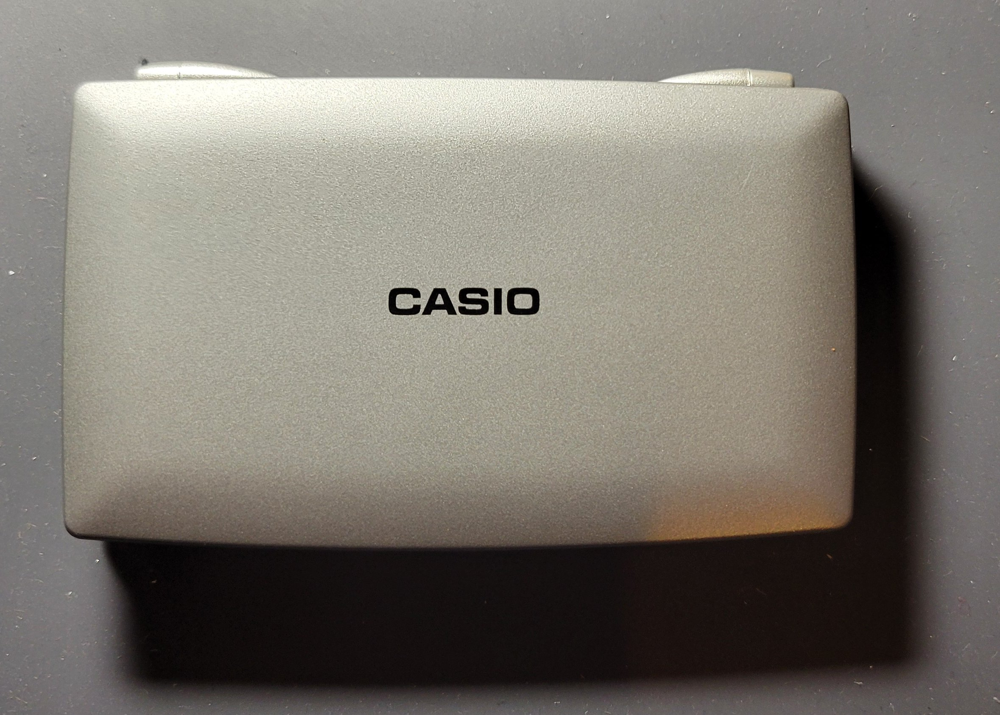
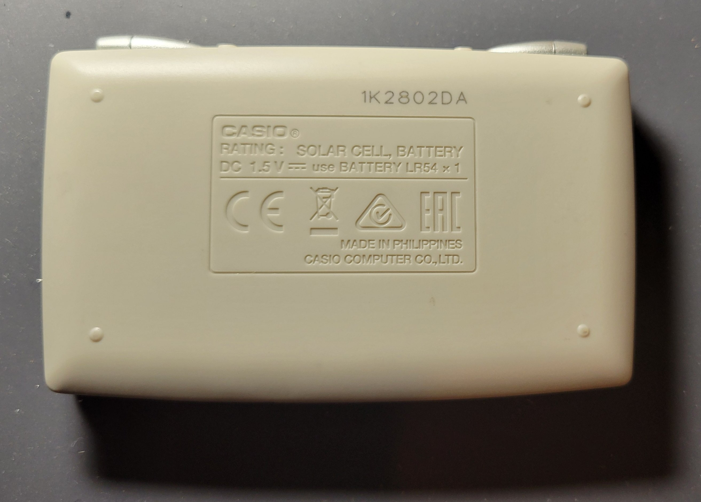
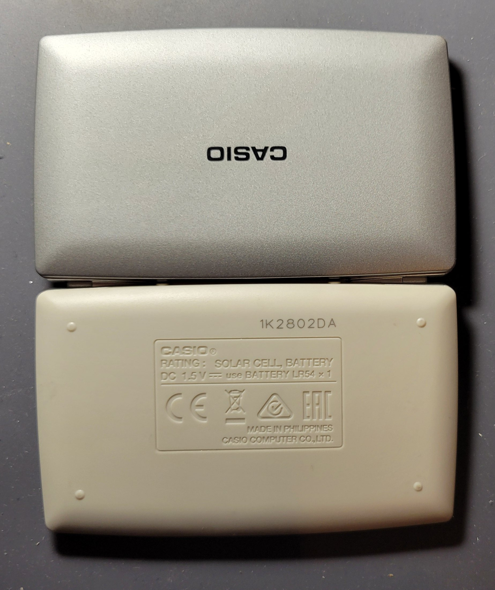
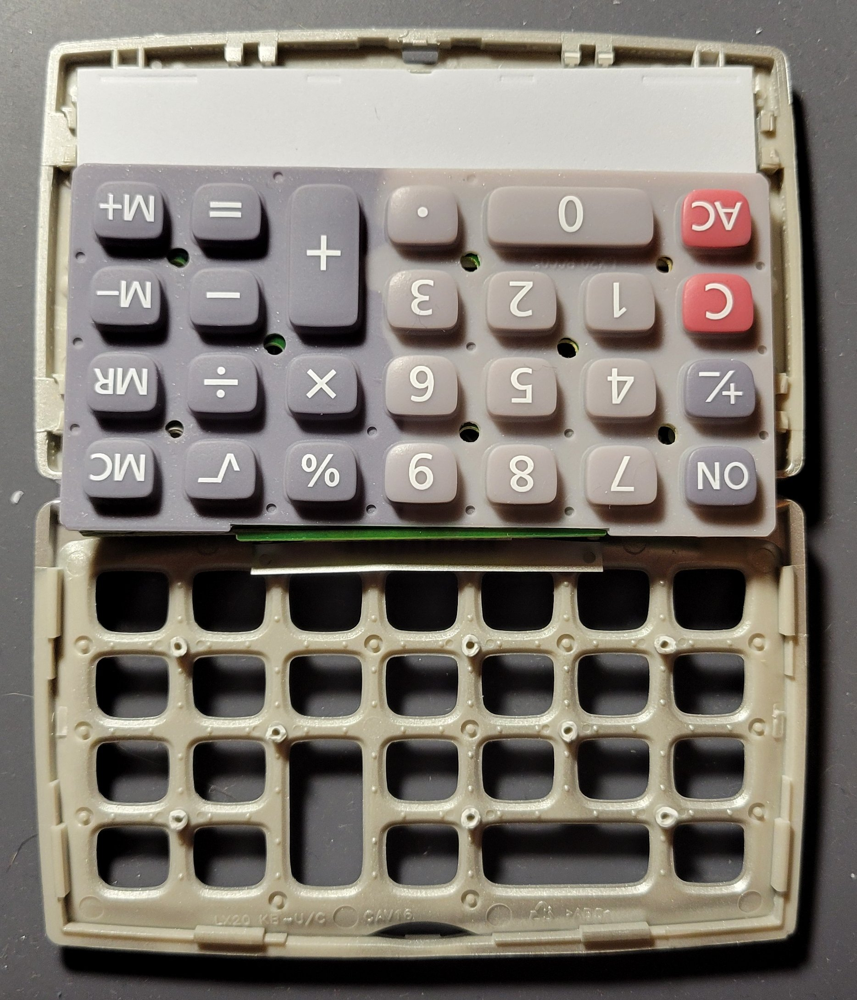
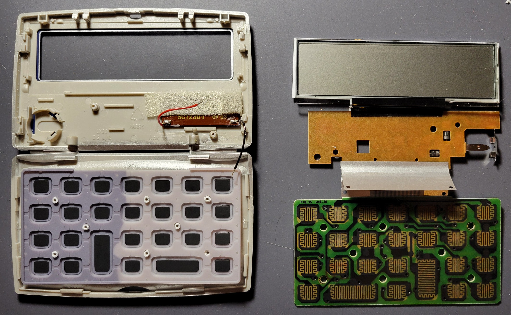
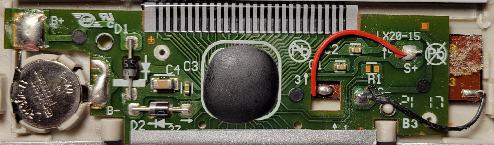
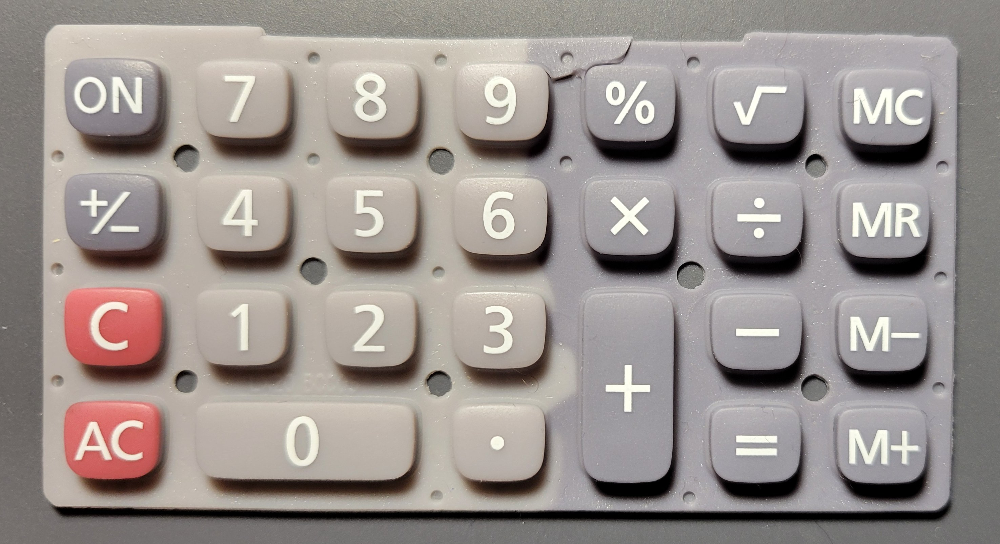
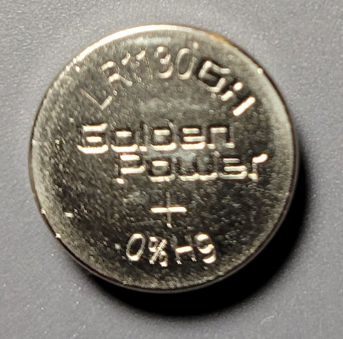

# Dissection Photo Journal

  Home: &#x2302; [Introduction](../index.md) &#x2302;  

##

## Photos

Standard Packaging (Front)

Standard Packaging (Back)

Calculator's Shell Case (Closed && Front)

Calculator's Shell Case (Closed && Back)

Calculator's Shell Case (Open && Front)

Calculator's Shell Case (Open && Back)

Calculator Top/Front Panel Removed; Secured by Two (2) Phillips Head Screws and Various Plastic Tabs and Notches

Calculator Bottom/Back Panel Removed; Secured by Plastic Tabs and Notches

Keypad PCB Removed from Shell; Held in Place by Plastic Columns with Flared Tips; Tips were Individually Sliced

Keypad PCB Removed from Shell with Labeled Circuit Pads

Silicone Keypad Removed from Shell

Front-Facing Circuitry Removed from Shell; Top Primary PCB was Held in Place Similar to the Keypad PCB with Flared Plastic Columns; Solar Cell was Desoldered

Back-Facing Circuitry Removed from Shell; Flex Cables Bridge the PCBs and LCD; Flex Cables are Protected by a Thin Metal Sheet to Prevent Damage by the Hinge

Solar Cell (Back); Protective Foam Used to Fill the Gap Between the Cell and Primary PCB was Removed

Solar Cell (Front)

Primary PCB (Back); Chip-on-Board (COB) Application-Specific Integrated-Circuit (ASIC) Underneath Black Epoxy Blob

Multiplex-Read Keypad PCB (Back)

Primary PCB (Front) with LCD and Solar Cell

Multiplex-Read Matrix Keypad PCB (Front); the Pads are Carbon-Coated in a Zig-Zag Pattern to Short with the Carbon Backs of the Silicone Keypad

Empty Shell (Top)

Empty Shell (Bottom with Silicone Keypad)

Empty Shell (Bottom)

Silicone Keypad (Front)

Silicone Keypad (Back); Carbon Coated Key-backs

LR1130 1.5V Battery; Primary Power Source

Phillips Head Screws from Shell

Alternative View: Phillips Head Screws from Shell

##

  Prev: ◄— [Product Market](../html/market.md) ◄—  
Next: —► [Product Operation](../html/operation.md) —►

##