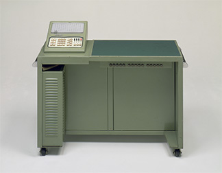
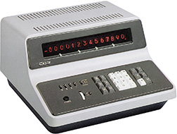
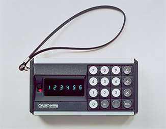
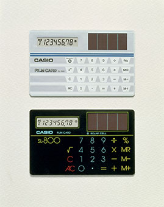
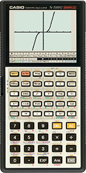
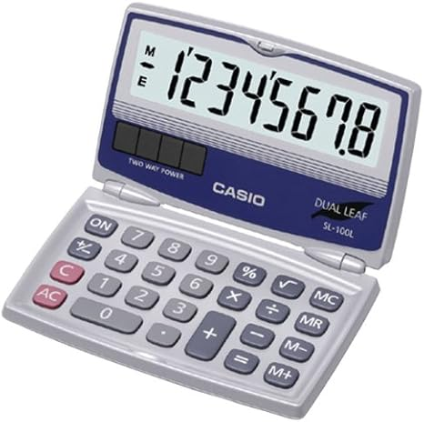
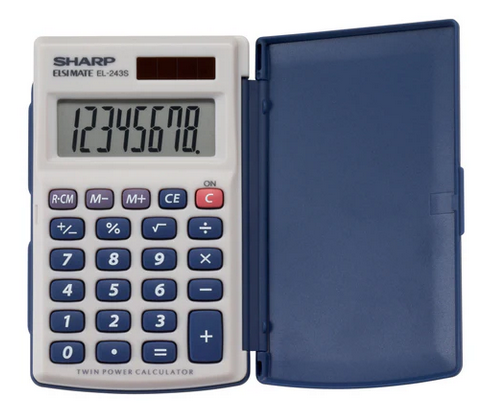
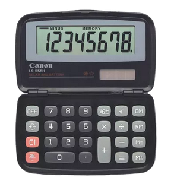
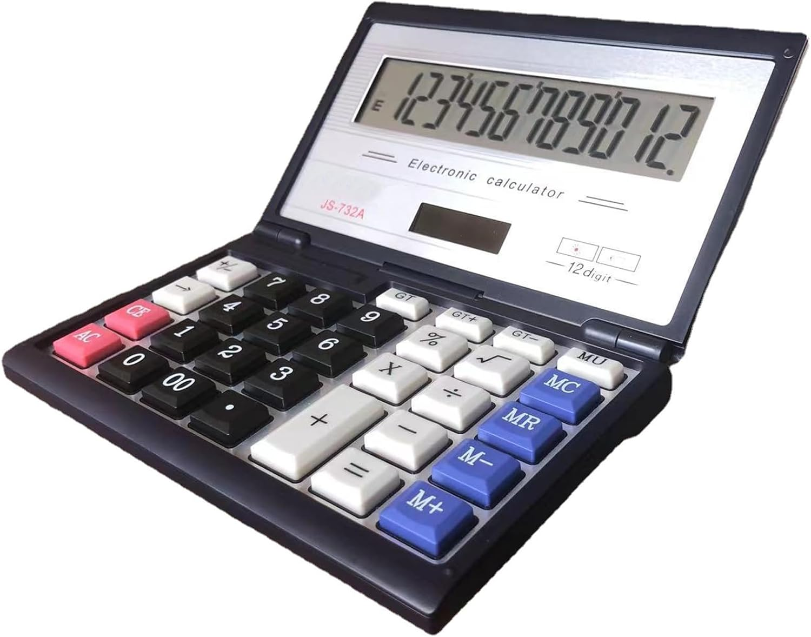

# Product Market and Retail Information

  Home: &#x2302; [Introduction](../index.md) &#x2302;  

##

## Product History

Before covering the SL-100L Dual Leaf Pocket Calculator's history, it is only right to start with the unique history of its creator, CASIO. CASIO has a history of innovation and creativity that seeps into every aspect of its existence, including its corporate philosophy; their mission is simple, "through the power to put wonder at hand, bring new levels of joy to lives one by one..." [\[1\]](#1-casio-philosophy-casiocom).

The following figures showcase CASIO's historical contributions to the calculator scene, which include one of the first calculators in CASIO's SL product line.

**Figure 1: 14-A – The World's First Compact All-Electric Calculator**

*Released June 1957* [\[2\]](#2-casio-casio-history-casiocom)

**Figure 2: AL-1000 – The World’s First Programmable Electronic Desktop Calculator**

*Released October 1967* [\[2\]](#2-casio-casio-history-casiocom)

**Figure 3: CASIO Mini – The World's First Personal Calculator**

*Released August 1972* [\[2\]](#2-casio-casio-history-casiocom)

**Figure 4: Film Card SL-800 – Credit-Card Size Calculator (0.8mm Thick)**

*Released November 1983* [\[2\]](#2-casio-casio-history-casiocom)

**Figure 5: FX-7000G – The World's First Graphing Scientific Calculator**

*Released August 1985* [\[2\]](#2-casio-casio-history-casiocom)

The Film Card SL-800 had a sleek and striking design, which gained it purchase to the Museum of Modern Art's archive [\[3\]](#3-moma-film-card-solar-calculator-momaorg). This calculator encompasses the same range of functionality as the SL-100L and originally sold for ¥5,900, or approximately $80.27 in today's money [\[4\]](#4-casio-calculator-collectors-casio-sl-800-d-casio-calculatorcom)[\[5\]](#5-pound-sterling-us-dollar--japanese-yen-historical-reference-rates-from-bank-of-england-for-1983-poundsterlinglivecom)[\[6\]](#6-us-inflation-calculator-inflation-calculator-usinflationcalculatorcom). Nearly 30 years after the release of the SL-800, the SL-100L became publicly available.

**Figure 6: SL-100L – Pocket Calculator**

*Released September 2012* [\[7\]](#7-amazon-casior-sl-100l-solar-calculator-with-folding-hard-case--amazoncom)

## Product Market

### Manufacturer's Suggested Retail Price (MSRP)

The SL-100L Pocket Calculator is available for direct order from CASIO for **$7.41** [\[8\]](#8-casio-sl-100l-pocket-calculator-casiocom).

### Retail Outlets

Like many other general function calculators, this device may be found at a variety of physical storefronts including supermarkets, office supply stores, and school supply chains. A few online listings have been provided as well.

* Amazon – $11.99 [\[7\]](#7-amazon-casior-sl-100l-solar-calculator-with-folding-hard-case--amazoncom)
* Underwood Distributing – $9.95 [\[9\]](#9-underwood-distributing-casio-sl-100l-foldable-pocket-calculator-underwooddistributingcom)
* Walmart – $5.72 [\[10\]](#10-walmart-casio-sl-100l-8-digit-folding-solar-calculator-large-display-walmartcom)

### Original Equipment Manufacturer (OEM) and Off-Brand Versions

The SL-100L is manufactured and sold by CASIO.

#### CASIO SL-100L

* MSRP: $7.41
* Dimensions (Closed–LxWxH): 3.6” x 2.2” x 0.5” 
* Basic Features: 8-Digit Display, 3-Digit Punctuation, Memory, Square Root, Percent Key, Sign Change, Constant, Auto Power Off
* Advanced Features: +/- Tax Keys, Decimal Setting
* Specialty Features: N/A
* Release Date: September 24, 2012

 

As a mass-produced consumer electronic device, the SL-100L has several similar products, including knock-offs and off-brand versions, some of which are listed below

#### Sharp EL-243SB

* MSRP: $8.29
* Dimensions (Closed–LxWxH): 2.5” x 4.1” x 0.4”
* Basic Features: 8-Digit Display, 3-Digit Punctuation, Memory, Square Root, Percent Key, Sign Change, Constant, Auto Power Off
* Advanced Features: +/- Tax Keys, Decimal Setting, Last Answer Recall
* Specialty Features: Cost/Sell/Margin Keys, Metric Conversions, Mark Up Key  
* Release Date: December 13, 2016

 

**Figure 7: Sharp EL-243SB Pocket Calculator** [\[11\]](#11-sharp-8-digit-pocket-calculator-with-hinged-hard-cover-el-243sb-sharpcalculatorscom)

#### Canon LS-555H

* MSRP: $12.99
* Dimensions (Closed–LxWxH): 4.3" x 2.7" x 0.6"
* Basic Features: 8-Digit Display, Memory, Square Root, Percent Key, Sign Change, Constant, Auto Power Off
* Advanced Features: +/- Tax Keys, Decimal Setting
* Specialty Features: N/A
* Release Date: June 21, 2007 

 

**Figure 8: Canon LS-555H Business Calculator** [\[12\]](#12-canon-ls-555h-handheld-display-calculator-usacanoncom)

#### Maizoon JS-732A

* MSRP: $12.99
* Dimensions (Closed–LxWxH): 6.5” x 4.1” x 0.9” 
* Basic Features: 12-Digit Display, 3-Digit Punctuation, Memory, Square Root, Percent Key, Sign Change, Constant, Auto Power Off
* Advanced Features: +/- Tax Keys, Decimal Setting
* Specialty Features:  "0" and "00" Number Keys, Abdication Function, Protective Metal Shield, Comparison
* Release Date: November 7, 2023

 

**Figure 9: Maizoon JS-732A Folding Clamshell Calculator** [\[13\]](#13-amazon-maizoon-solar-dual-power-calculator-with-12-digit-display-large-screen-folding-flip-cover-big-button-portable-computing-tool-for-finance-business-office-and-school-amazoncom)

The Maizoon calculator is especially interesting as it is the only off-brand calculator shown in this section; this model of calculator is also listed online as the JOINUS JS-732A/CT-8855V, the Neel CT-8855V, and the CITHZEN CT-8855V. It has a very tactile appearance and claims to be powered off AAA batteries in addition to solar. It also boasts comparison operators (greater than and less than) as part of its specialty functionality.

While some of the other devices may provide unique features, none of them match the sleek form factor, tasteful appearance, or accessible presentation of CASIO's SL-100L; the [Canon LS-555H](#canon-ls-555h) comes close, but lacks the refinement required to justify its higher price point.

##

  Prev: ◄— [Introduction](../index.md) ◄—  
Next: —►[Photo Journal](../html/journal.md) —►

##

## References

#### \[1\] CASIO, “Philosophy,” casio.com.

https://world.casio.com/corporate/principle/ (accessed Apr. 23, 2025).

#### \[2\] CASIO, "CASIO History,” casio.com.

https://world.casio.com/corporate/history/ (accessed Apr. 23, 2025).

#### \[3\] MoMA, "Film Card Solar Calculator,” moma.org.

https://www.moma.org/collection/works/2935?artist_id=1011&page=1&sov_referrer=artist

#### \[4\] CASIO Calculator Collectors, "Casio SL-800 (D),” casio-calculator.com.

https://www.casio-calculator.com/Museum/Pages/SSS/SL-800%20(D)/SL-800%20(D).html (accessed Apr. 23, 2025).

#### \[5\] Pound Sterling, "U.S. Dollar / Japanese Yen Historical Reference Rates from Bank of England for 1983,” poundsterlinglive.com.

https://www.poundsterlinglive.com/bank-of-england-spot/historical-spot-exchange-rates/usd/USD-to-JPY-1983 (accessed Apr. 23, 2025).

#### \[6\] US Inflation Calculator, "Inflation Calculator,” usinflationcalculator.com.

https://www.usinflationcalculator.com/ (accessed Apr. 23, 2025).

#### \[7\] Amazon, "Casio(r) Sl-100l Solar Calculator With Folding Hard Case ,” amazon.com.

https://www.amazon.com/Casio-Sl-100l-Solar-Calculator-Folding/dp/B00CSX8FXG (accessed Apr. 23, 2025).

#### \[8\] CASIO, “SL-100L Pocket Calculator,” casio.com.

https://www.casio.com/us/basic-calculators/product.SL-100L/ (accessed Apr. 21, 2025).

#### \[9\] Underwood Distributing, “Casio SL-100L Foldable Pocket Calculator,” underwooddistributing.com.

https://underwooddistributing.com/products/casio-sl-100l-pocket-calculator-foldable (accessed Apr. 24, 2025).

#### \[10\] Walmart, “Casio SL-100L 8-Digit Folding Solar Calculator, Large Display,” walmart.com.

https://www.walmart.com/ip/Casio-SL-100L-8-Digit-Folding-Solar-Calculator-Large-Display/13246943 (accessed Apr. 24, 2025).

#### \[11\] Sharp, “8 Digit Pocket Calculator with Hinged Hard Cover (EL-243SB),” sharpcalculators.com.

https://sharpcalculators.com/products/el243sb (accessed Apr. 24, 2025)

#### \[12\] Canon, “LS-555H Handheld Display Calculator,” usa.canon.com.

https://www.usa.canon.com/shop/p/ls-555h?color=Black&type=New (accessed Apr. 24, 2025).

#### \[13\] Amazon, “Maizoon Solar Dual Power Calculator with 12-Digit Display Large Screen Folding Flip Cover Big Button Portable Computing Tool for Finance Business Office and School,” amazon.com.

https://www.amazon.com/Maizoon-Calculator-12-Digit-Portable-Computing/dp/B0CMTJC24Z?source=ps-sl-shoppingads-lpcontext&ref_=fplfs&psc=1&smid=A1BAUAL7DLTVKK&gQT=1 (accessed Apr. 24, 2025).
