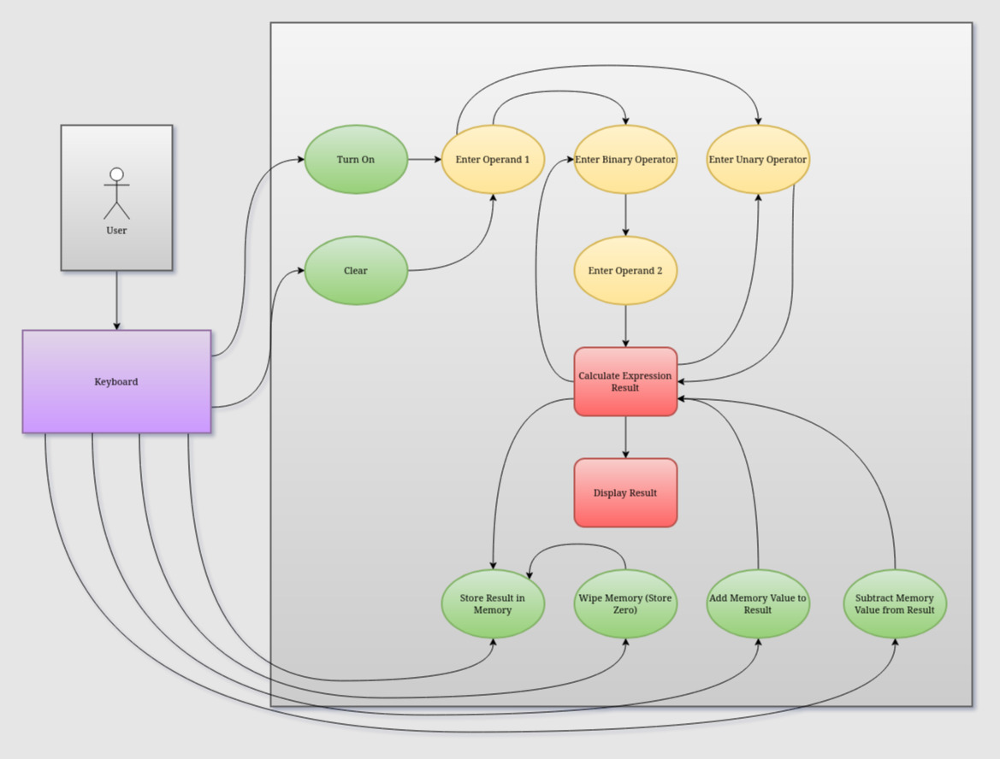

# Product Operation

  Home: &#x2302; [Introduction](../index.md) &#x2302;  

##

## Human-Machine Interface

## Timing Diagrams

**Timing Diagram 1: LCD Common Plane Pin Reading**

**Timing Diagram 2: LCD Static Pin Reading**

**Timing Diagram 3: LCD Segment Pin Reading**

Talk about 3 types of pins to LCD, their functions, measurements, and why they might be different.

 

**Timing Diagram 4: Keypad Button Press**  

The keyboard is in a standard, multiplexed, row-column arrangement, meaning each key-press results in two separate signals being sent to the microcontroller; the microconroller would use the input origin of each signal to determine which key was pressed and decide the appropriate response. The above timing diagram only shows the reading from one of the signals generated from such a button-press.

##

  Prev: ◄— [Photo Journal](../html/journal.md) ◄—  
Next: —► [Product Analysis](../html/analysis.md) —►

##