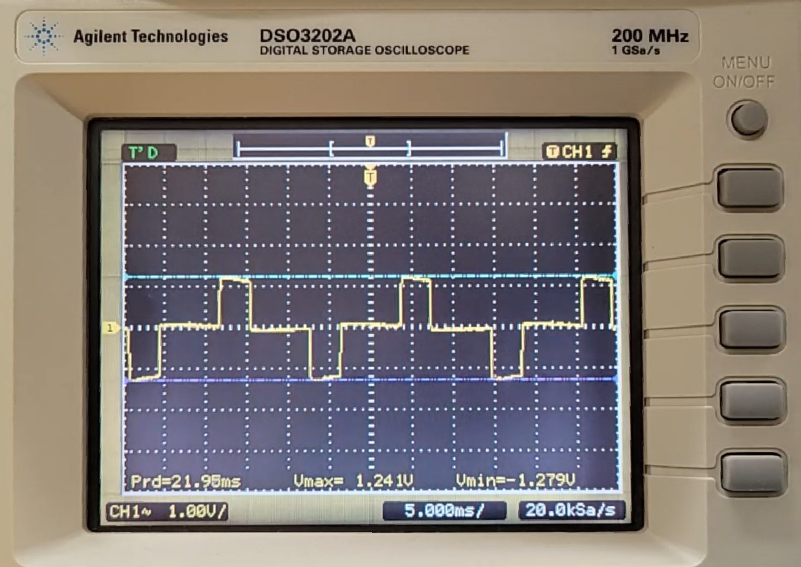
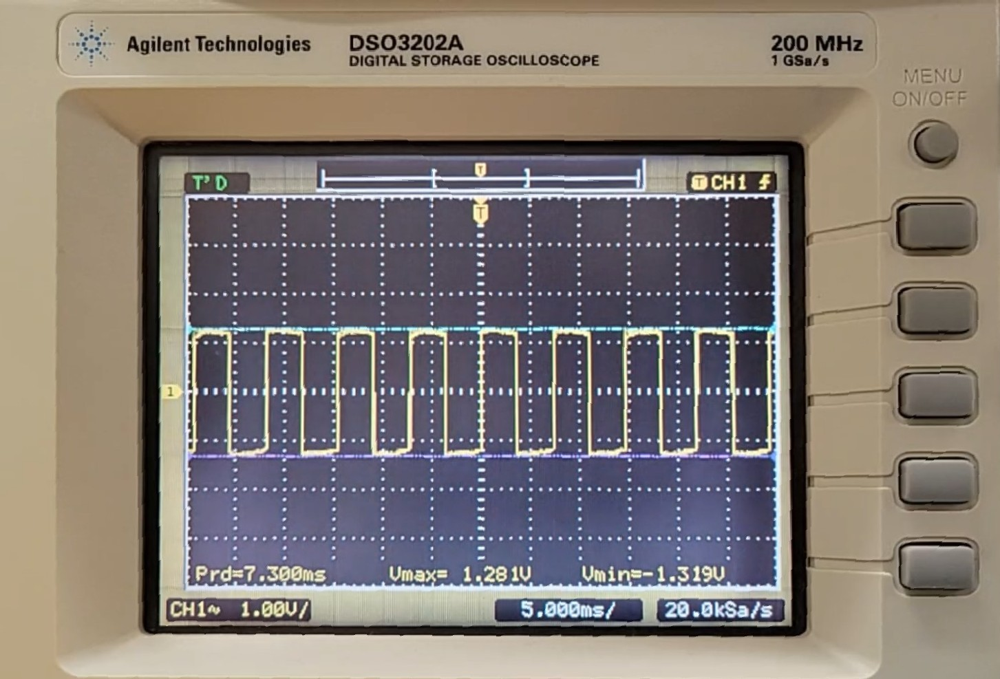

# Product Operation

  Home: &#x2302; [Introduction](../index.md) &#x2302;  

##

## Human-Machine Interface

**Figure 1: Calculator Use-Case Diagram**

The keyboard serves as the primary point of user interaction with the device; it provides a number of potential actions or operations to the user depending on the current state. As shown in the above figure, green states represent actions available to the user at any point; although, many of these states may not produce the desired behavior unless specific conditions are met, such as the memory operations. Yellow states require the preceding states or conditions to have occurred before they are available to the user, e.g. an operand must be entered before selecting an operand. Red states are terminal states managed and determined by the device's internal logic.

## Timing Diagrams

The following timing diagrams were taken in moderately lit conditions; the battery was removed and the solar cell provided a supply voltage of ~1.3V DC. The periods and frequencies of the signals are not dependant on the  supply voltage; however, the amplitude, or peak-to-peak voltages, of the signals are dependant on the supply voltage (this is discussed further in the Electronic Characteristics section of the [Product Analysis](../html/analysis.md)).

**Timing Diagram 1: LCD Common Plane Pin Reading**

*Period: 21.95ms*  
*Amplitude: 2.52V*

**Timing Diagram 2: LCD Segment Pin Reading 1**

*Period: 7.30ms*  
*Amplitude: 2.6V*

**Timing Diagram 3: LCD Segment Pin Reading 2**

*Period: 21.90ms*  
*Amplitude: 2.84V*  

Analysis of the 27-pin interface revealed the presence of 3 common plane pins and 24 segment pins, which together support all 72 segments (3 * 24) on the display (made up of 8 seven-segment digits, 8 decimal points, 5 commas, 1 negative sign, 1 exponential indicator, and 1 memory indicator).

The timing diagrams reveal that the LCD is driven using 4 voltage levels: ±1.25V, ±1.3V, ±1.42, and GND (0V). Based on the these voltage levels, the timing diagrams, and earlier pin analysis, it was concluded that the LCD is multiplexed, or dynamic, and operates using a 1/3 bias driving scheme.

***Bias = 1 / (# Voltage Levels - 1)***

Interestingly, regardless of the number of digits input or the type of digit (0-9), all numerical segment pins seemingly produce one of two AC signals; there was no difference in voltage amplitude, signal shape, or RMS values within these signal types. However, this behavior may be explained through multiplexed LCDs use of time-division control where all segment pins are driven with similar waveforms; in other words, the relative timing between segment and common signals is what determines the display output and not necessarily the shape or amplitude of a single pin’s waveform. Regardless, this makes it difficult to determine exactly which pins line up with which segments.

 

**Timing Diagram 4: Keypad Button Press**  

*Period: 16.10ms*  
*Amplitude: 1.6V*  

The keyboard follows a standard multiplexed row-column arrangement, where each keypress generates two separate signals sent to the microcontroller. The microcontroller uses the origin of these signals (which row and column are involved) to determine which key was pressed and then decide the appropriate response. The timing diagram above shows only the signal corresponding to one of the inputs generated by a button press.

##

  Prev: ◄— [Photo Journal](../html/journal.md) ◄—  
Next: —► [Product Analysis](../html/analysis.md) —►

##
