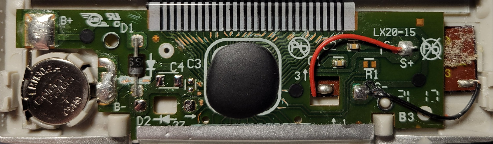
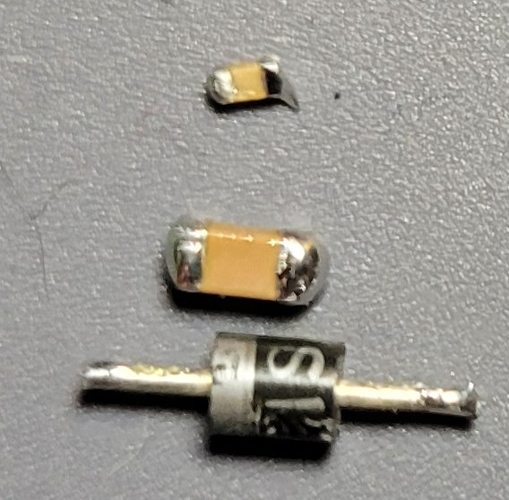
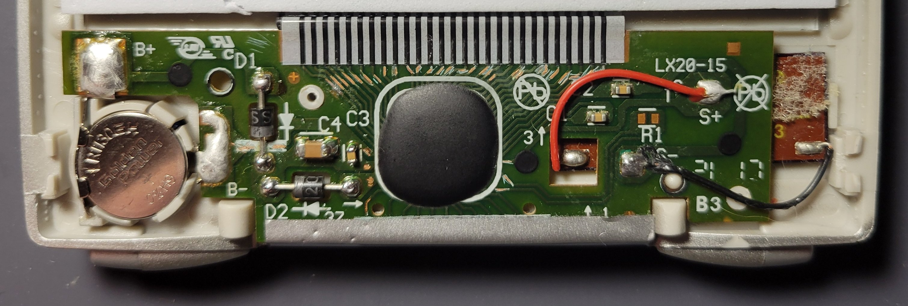
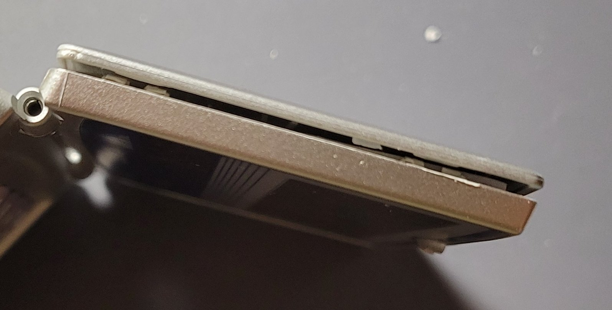
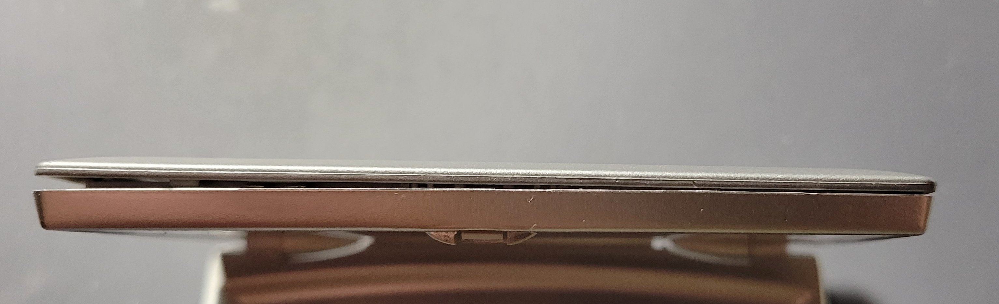

# Post-Dissection Product Reassembly

  Home: &#x2302; [Introduction](../index.md) &#x2302;  

##

## Reassembly

### Photos

Primary PCB with C3, C4, and D2 Removed for Rating Measurements; All Traces to LCD and Battery were Scratched to Remove Protective Layering for Measurements and to Acquire Timing Diagrams; Select Traces to Keypad and Solar Cells were Scratched for the Same Purpose

C3, C4, and D2 (Top to Bottom)

Primary PCB with All Components Reattached and Solder Reflowed

Calculator's Shell Case; Plastic Tabs on the Top of the Case were Damaged During Disassembly and No Longer Latch

Calculator's Shell Case; Damaged

##

Aside from minor damage to the external shell and the loss of a screw, the device is fully functional. The PCB was cleaned with isopropyl alcohol, and all exposed traces on the primary PCB were coated with clear nail polish to help prevent potential degradation of the traces.

##

  Prev: ◄— [Product Analysis](../html/analysis.md) ◄—  
Next: —► [Lessons Learned](../html/learned.md) —►

##