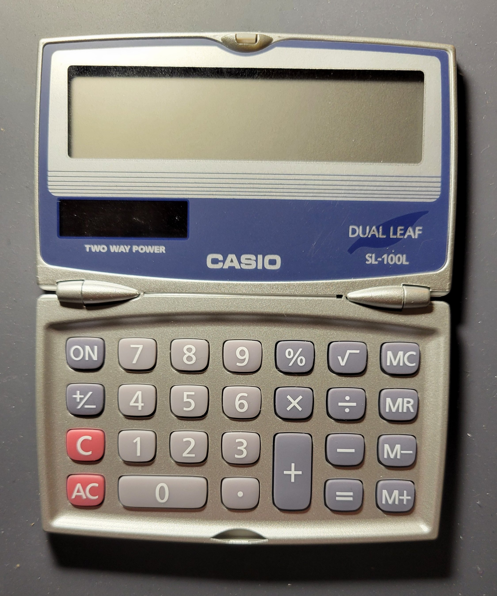

# MSU ECE-4724 Embedded Dissection Project 

## Table of Contents

* [Introduction](#personal-introduction)
* [Product Market](./html/market.md)
* [Photo Journal](./html/journal.md)
* [Product Operation](./html/operation.md)
* [Product Analysis](./html/analysis.md)
* [Reassembly](./html/reassembly.md)
* [Lessons Learned](./html/learned.md)

## Personal Introduction

## Product Introduction

A CASIO SL-100L Dual Leaf Pocket Calculator, pictured below, was chosen as the subject of this dissection.

**Figure 1: CASIO SL-100L Dual Leaf Pocket Calculator**

### Background

The SL-100L is a basic folding calculator with no scientific functions and limited memory operations; it is capable of standard mathematical operations using only a single binary or unary operator at a time. It has two power sources: a button cell battery and solar cells. Also, the calculator utilizes a 8-digit 7-segment LCD for the display.

### Motivation

A calculator was chosen for this dissection because calculators as a whole are readily available and widely used devices. Additionally, basic non-scientific, non-graphing calculators are textbook examples of embedded systems: they are non-programmable, application-specific devices that use several user-facing input/output components, such as LCDs and keypads. Furthermore, studying the inner-workings of a calculator serves as an excellent entry point into embedded systems, as they typically lack complex or confusing circuitry; this allows the person performing the dissection to focus on understanding the embedded applications without necessarily being overwhelmed by the device’s underlying electrical operations.

##

  Next: —► [Product Market](./html/market.md) —►

##
