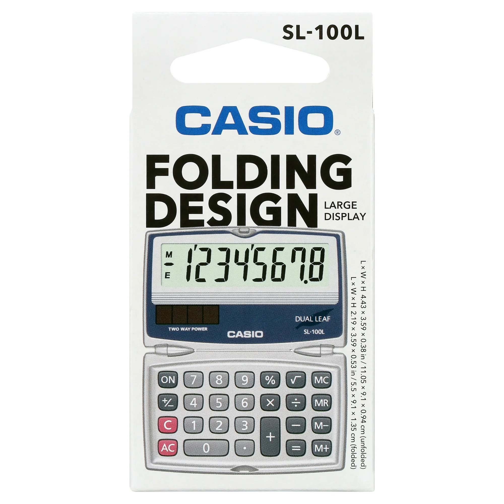
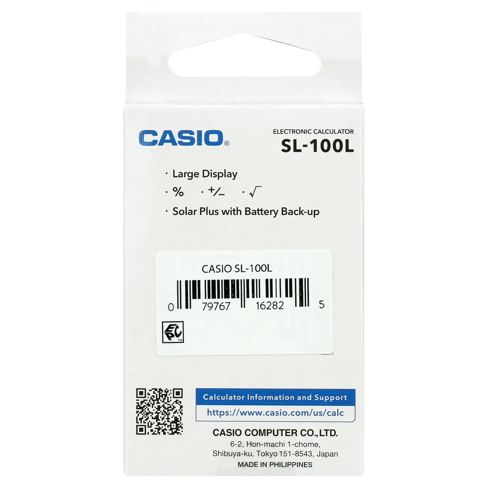
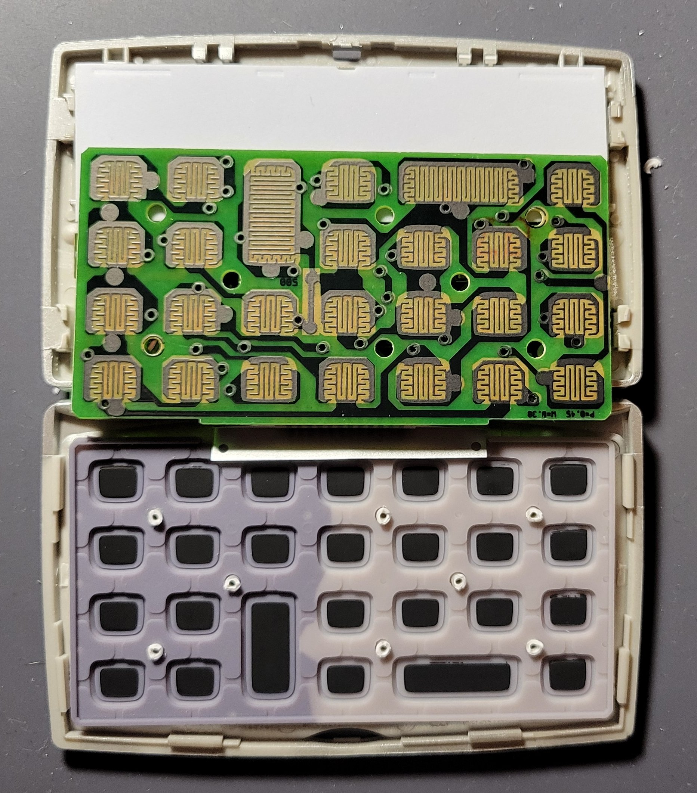
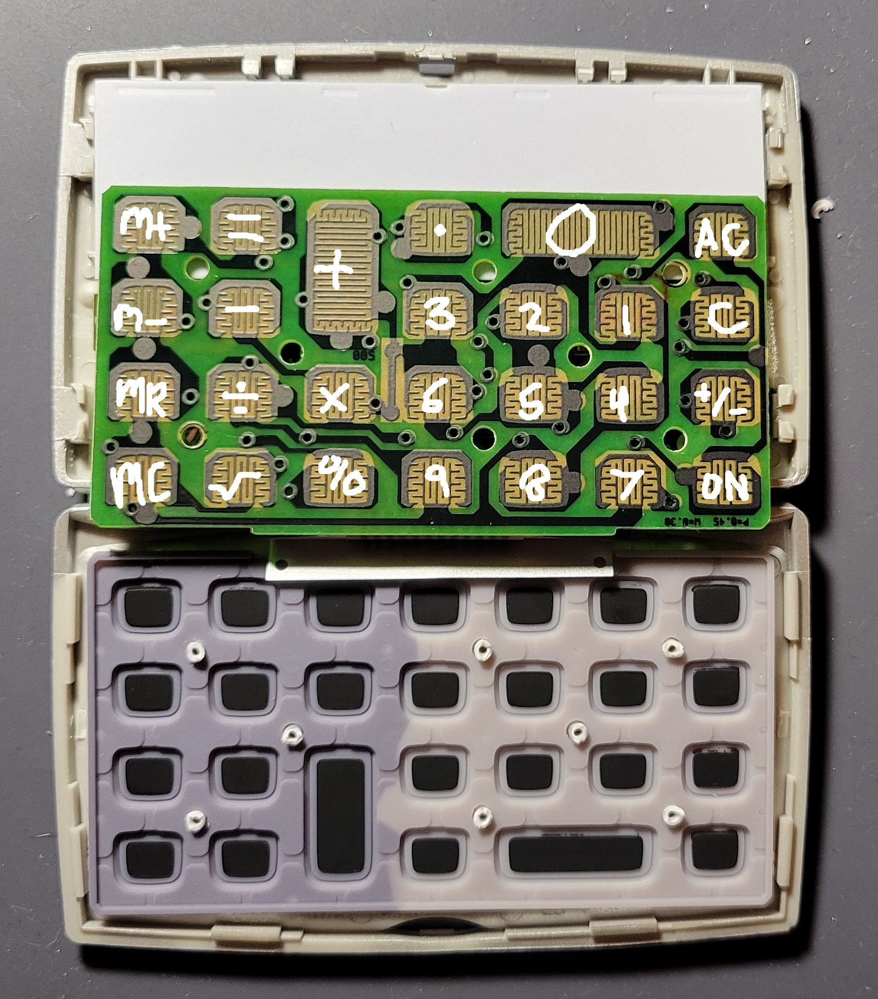
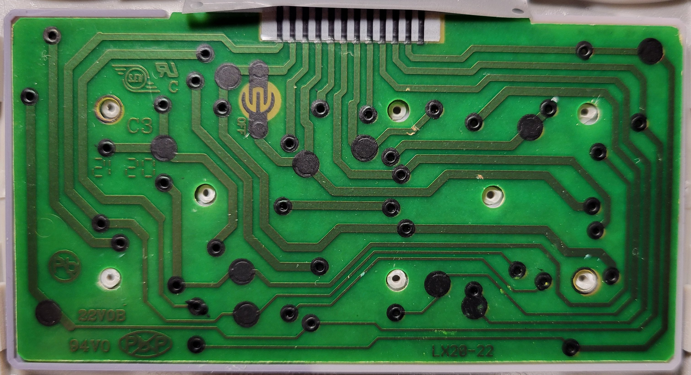
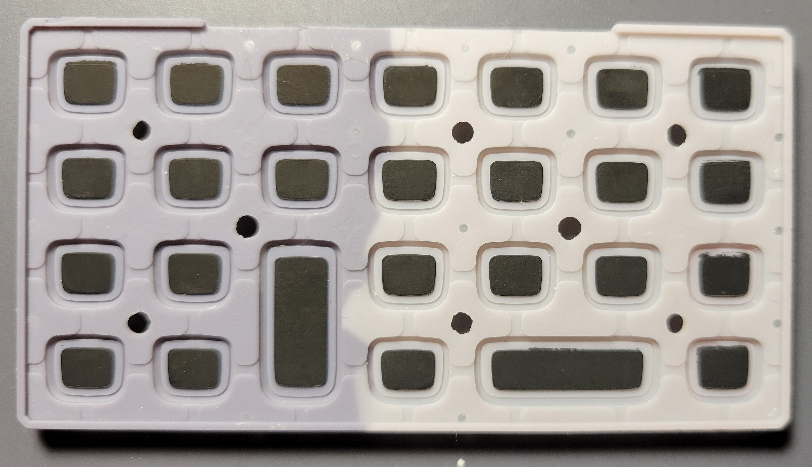
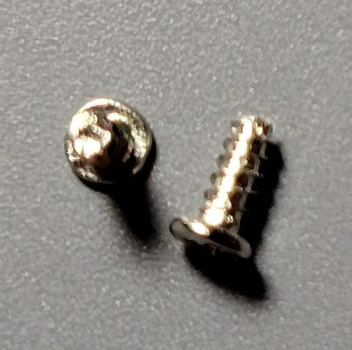
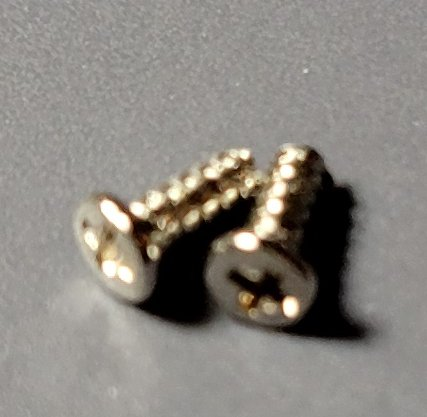

# Dissection Photo Journal

  Home: &#x2302; [Introduction](../index.md) &#x2302;  
Prev: ◄— [Product Market](../markdown/market.md) ◄—  
Next: —► [Product Operation](../markdown/operation.md) —► 

##

## Dissection

### Photos

**Figure 1: Standard Packaging (Front)**

##

**Figure 2: Standard Packaging (Back)**

##

**Figure 3: Calculator's Shell Case (Closed && Front)**

##

**Figure 4: Calculator's Shell Case (Closed && Back)**

##

**Figure 5: Calculator's Shell Case (Open && Front)**

##

**Figure 6: Calculator's Shell Case (Open && Back)**

##

**Figure 7: Calculator Top/Front Panel Removed**

The front panel was secured to the rest of the frame by two (2) Phillips head screws and various plastic tabs and notches.

##

**Figure 8: Calculator Bottom/Back Panel Removed**

The back panel was also secured by plastic tabs and notches.

##

**Figure 9: Keypad PCB Removed from Shell**

The keyboard's PCB was held in place by plastic columns with flared tips; these tips were individually sliced to remove the PCB.

##

**Figure 10: Keypad PCB Removed from Shell with Labeled Circuit Pads**

##

**Figure 11: Silicone Keypad Removed from Shell**

##

**Figure 12: Front-Facing Circuitry Removed from Shell**

The top/primary PCB was held in place similar to the keypad PCB with flared plastic columns. The solar cells had to be de-soldered as they were held to the shell by an adhesive that could not be reached without first removing the main board.

##

**Figure 13: Back-Facing Circuitry Removed from Shell** 

Flex cables bridge the PCBs and LCD; the flex cable connecting the PCBs is covered by thin metal sheets on either side which prevents it from being exposed and potentially damaged when the shell is closed. 

##

**Figure 14: Solar Cell (Back)**

A protective foam strip was used to fill the gap between the solar cells and the primary PCB. This strip was attached to the solar cells and the plastic frame by an adhesive that had to be scrapped away to reveal the component model details.

##

**Figure 15: Solar Cell (Front)**

##

**Figure 16: Primary PCB (Back)** 

The PCB contains a chip-on-board (COB) application-specific integrated-circuit (ASIC) underneath the blob of black epoxy.

##

**Figure 17: Multiplex-Read Keypad PCB (Back)**

##

**Figure 18: Primary PCB (Front) with LCD and Solar Cell**

##

**Figure 19: Multiplex-Read Matrix Keypad PCB (Front)**

The PCB pads are coated with carbon in a zig-zag pattern; this allows them to short with the backs of the silicone keypads which are also carbon coated.

##

**Figure 20: Empty Shell (Top)**

##

**Figure 21: Empty Shell (Bottom with Silicone Keypad)**

##

**Figure 22: Empty Shell (Bottom)**

##

**Figure 23: Silicone Keypad (Front)**

##

**Figure 24: Silicone Keypad (Back)**

Figure 24 highlights the appearance of the previously mentioned carbon coated key-backs.

##

**Figure 25: LR1130 1.5V Battery**

This battery serves as the device's primary power source.

##

**Figure 26: Phillips Head Screws from Shell**

##

**Figure 27: Alternative View – Phillips Head Screws from Shell**

##

  Home: &#x2302; [Introduction](../index.md) &#x2302;  
Prev: ◄— [Product Market](../markdown/market.md) ◄—  
Next: —► [Product Operation](../markdown/operation.md) —►

##
